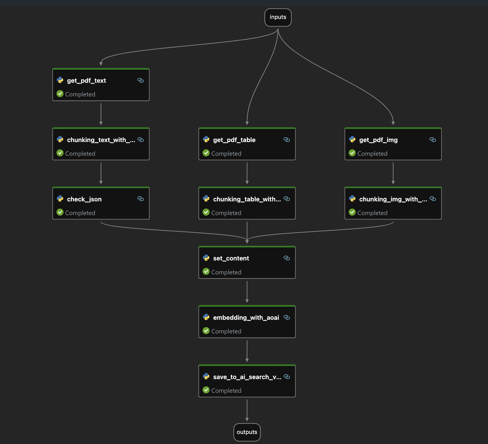

# **Using SLM(Phi-3) Chunking PDF Documents**

In RAG applications, how to extract unstructured content and make LLM better chat your unstructured data is what people have been discussing. Constrained by LLM tokens, we generally complete document chunking. But how to maintain the coherence of the content? This is what we have been discussing. This example uses Microsoft Phi-3 as a context understanding tool to help us divide related content more effectively.

### **Steps**

1. Extract information including text, images and tables from the pdf document. PyPDF is used for text and images, and Azure Document Intelligence is used for charts

2. Slice the extracted text/table through Phi-3/Phi-3.5 Instruct. Of course, Prompt is very important. It is necessary to keep the context coherence and keep the original text as much as possible.

    ***Samples***

   - Chunking Text : [Click here](./prototype/01.chunking_text.ipynb)

   - Chunking Table : [Click here](./prototype/03.chunking_table.ipynb)

3. Understand the extracted images through Phi-3/Phi-3.5 Vision

    ***Samples***

   - Chunking Image : [Click here](./prototype/03.chunking_imgs.ipynb)

4. Reorganize and merge the text, images and tables to complete the real chunking

5. Complete quantization through the Azure OpenAI Service text-ada-embedding model and save it to AI Service.

**This is SLM Trunking flow diagram**

***Samples***

   - SLM Chunking FLow : [Click here](./code/slm-chunking-flow/)
  
   - SLM Chunking Chat : [Click here](./code/slm-chunking-chat/)

